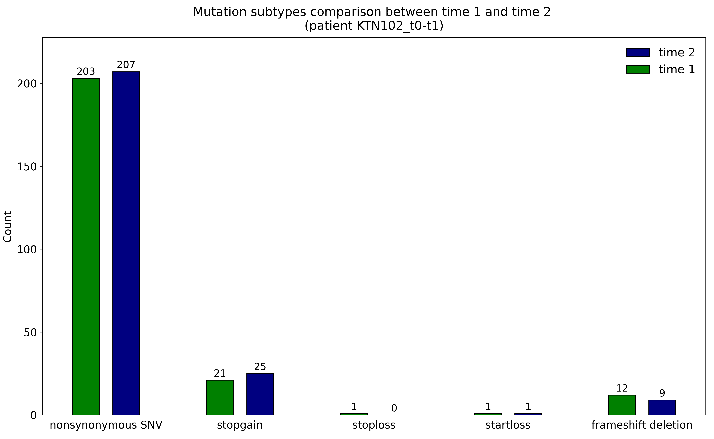

<p align="center">
   
</p>

<p align="center"> 
    <a href="#contributors" alt="Contributors">
        </a> 
    <a href="#backers" alt="Backers">
        </a>
    <a href="#commits" alt="Commits">
        </a>
    <a href="#coverage" alt="Coverage">
        </a>
    <a href="#codacy" alt="Codacy">
        </a>
    <a href="#languages" alt="Languages">
        </a>
    <a href="#version" alt="Version">
        </a>
    <a href="#packages" alt="Packages">
        </a>
    <a href="#parameters" alt="Parameters">
        </a>
    <a href="#example" alt="Example">
        </a>
    <a href="#validation" alt="Validation">
        </a>
    <a href="#institute" alt="Institute">
        </a>
    <a href="#country" alt="Country">
        </a>
</p>

### $${\color{lightblue}LOncoG: \space a \space software \space for \space Longitudinal \space OncoGenomics \space analysis}$$
This software plots, compares and merges information from all exomes of a cohort of cancer patients before and after treatment. It also includes a customizable filter to help you removing remaining germline and/or non driver mutations (even without a paired normal sample). The Filter, Summarise, Compare and Merge modules can be run separately or all together. If your study is not longitudinal, you can just run the first two modules to get a graphical and statistical sumup of the most impactant variants from your WES data. The software is designed to be user-friendly and to be used by bioinformaticians, biologists and even clinicians research teams.


## Versions
☑️ ```1.0```: the first version (06/2023) is available on [GitHub](https://github.com/gsiekaniec/LOTUS). \
✅ ```2.0```: the new version (04/2024) is a pre-release and is the current version. \
☑️ ```3.0```: the final version (07/2024) will be the version associated with the futur potential paper. \
3.0 version will use HGVS and rsids, input more annotations formats (including VEP from Ensembl), perform more API requests and a wider choice of plot shapes. 
LOncoG will perform clustering on patients similarities and will run with a multiprocessing option.

## Warnings
- LOncoG is still in development and should not be used for clinical purposes yet. 
- The software is not yet optimized for large cohorts of patients.
- Protein impacts predictions only works with ANNOVAR dbsnfp41a database for the moment.
- Variant allelic frequency in population only works with ANNOVAR gnomad40 database for the moment.

## Project Organization
The project is organized as follows:
```Project/
├── python_scripts/
│   ├── reusable_functions/         -> Functions used in the main scripts to parse vcf, etc.
│   ├── api_requests/               -> Functions to request information from external databases.
│   └── modules/                    -> Main modules scripts to run the software.
├── input/
│   ├── resources/                  -> Resources used in the software (reference genome, etc).
│   └── vcf/                        -> VCF default input folder.
├── environment/
├── tutorials/
│   ├── pictures/                   -> Pictures used in the tutorials.
│   └── examples/                   -> README for parameters, input examples.
├── toy_dataset/
│   ├── toy_vcf/                    -> VCF toy dataset.
│   └── toy_output/                 -> Output of the toy dataset.
├── output/
│   └── hour_month_year/            -> Auto-generated folder with the date and time of the run
|       ├── samples/                -> Filtered vcf and Summarise plots, one subfolder per sample/exome.
|       ├── comparisons/            -> Plots from Comparison module, one subfolder per patient (pair).
|       └── merge/                  -> Plots from Merge module, no subfolder.        
├── README.md                       -> This file, the main README.
└── logs/                           -> Logs are created here.
```
Being at ease with the project organization is important to get a good understanding of the software functioning.
*Please make sure to read the [Parameters.md](tutorials/Parameters.md) file to understand how to choose the parameters for the software.*

## Installation
### Prerequisites
Python 3.9 and Conda need to be installed on your machine. You can also use pip instead of Conda.

### Conda (recommended)
Clone the repository and navigate to the project directory.
Create a Conda environment using the [loncog_conda.yml](environment/loncog_environment.yml) file with the following command: 
```bash
conda env create -f environment/loncog_environment.yml --name loncog
```
Then, activate the environment with: 
```bash
conda activate loncog
```

You are also free to use the [loncog_conda.txt](environment/loncog_environment.txt) file if you prefer to install the packages manually with: 
```bash
conda env create --file environment/loncog_environment.txt --name loncog
```
Then, activate the environment with: 
```bash
conda activate loncog
```

### Virtual environment (venv)
Clone the repository and navigate to the project directory.
Create a virtual environment using the [loncog_environment.yml](environment/loncog_environment.yml) file with the following commands: 
```bash
python3 -m venv loncog 
source loncog/bin/activate # if Unix/macOs
loncog\Scripts\activate.bat # if Windows
pip install -r environment/loncog_environment.yml
```
## Compatible annotators
LOncoG is based on vcf annotations from input files, here is a list of compatible annotators for v2.0 (more to come):
| Annotator | Version | Information used |
| :-------: | :-----: | :--------------: |
| [ANNOVAR](https://annovar.openbioinformatics.org/en/latest/)  |   2020-06   |    refGene, gnomad40_exome, clinvar_20140702, cosmic70, avsnp150, dbnsfp30a   |
| [GATK Funcotator](https://gatk.broadinstitute.org/hc/en-us/articles/360037224432-Funcotator)  |    4.1.2.0    |    "funcotation" field is fully parsed by LOncoG     |
| [SnpEff](http://pcingola.github.io/SnpEff/snpeff/introduction/)  |    5.2 (2023-10)    |    Putative_impact from ANN field is used (more to come)     |

## Usage
This section describes the quick steps you need to follow to run the software.

### Parameters
The power of LOncoG is that you can run the modules separately or all together. 
**If you have already ran a module before**, you can specify the path of the folder where the results are saved. **For example, if you have already run Filter and Summarise in a folder, you can use its path to complete it with Compare and Merge analysis. If you don't specify, LOncoG will not be able to read results from Filter and Summarise, that are necessary for Compare and Merge modules.**
Choose the parameters for the software in the [config.txt](config.txt) file. \
An exhaustive description with examples and advices is available in [PARAMETERS.md](tutorials/Parameters.md) file.

### Dataset table
If you plan to run Compare and Merge modules, you need to create a dataset, indicating the names of your files from time 1 and time 2, as well as the name of your time-paired files (example: exome 1 from time 1 and exome 1 from time 2 from same patient x). This allows plots to use pair names instead of concatenating the names of the two vcf files for each patient (would sometimes form really long pair names).

Here is how this dataframe should look like, for 6 different patients (exome sequenced before and after treatment):

```time1_column_name``` = "Time 1" | ```time2_column_name``` = "Time 2" | ```pair_names_column_name``` = "Pair"

### Input files
The software is designed to work with VCF files. You can use the toy dataset provided in the [toy_dataset](toy_dataset/toy_vcf/) folder to test the software.
The VCF format must be respected, so LOncoG can parse files easily:


1) Download resources files from this link: \
https://drive.google.com/drive/folders/1gktCt6VzxNY-zJEjFUIUQHVW8jW0c1wM?usp=sharing. \
> **If you don't use hg38 genome version, download the equivalent files in your own version**.
1) Put the resources files in the [resources](input/resources/) folder. \
3) Choose your VCF files and put them in the [vcf](input/vcf/) folder. \
> Note: you can choose a custom path with the ```vcf_folder``` parameter in the [config.txt](config.txt) file.
4) Fill your dataset table with the names of your VCF files (pair by pair), as explained above. \
5) Run the software.

### Running the software
For 20 patients (with 2 exomes of 10k variants each), the software will take around 30 minutes to run all modules (15 if no enrichment analysis). \
To run the script, activate the environment if not already active, and run loncog.py from a Linux system as follows:
```bash
python3 loncog.py
```
You can even run LOncoG under a Windows environment, from your IDE (please make sure to activate the environment before running the script). 
Some old IDEs such as PyScripter are not adapted to loading bars and colored printing, so you can choose ```colored_execution = no```.

LOncoG will then run the modules you chose, read the parameters from the [config.txt](config.txt) file, read the 
input dataframe (at ```dataset_path``` location), and parse the VCF found at the ```vcf_folder``` location. \
So you can remember the parameters and table you used for each run, they are saved in the root of the output folder. 

The output will be saved in the [output](output/) folder by default, in a subfolder named with the date and time of the run. \
If you chose a specific output folder (```output_folder_path```), the results will be saved here.

During the execution you will have more or less verbose prints dpeending on your choice, that should look like this:
<p float="center"></p>
<p float="center"></p>
<p float="center"></p>
<p float="center"> </p>

Once LOncoG is done, [```job_done.wav```](input/resources/job_done.wav) is played, so you are notified immediately.

## Toy-dataset
In the [toy_dataset](toy_dataset) folder, you will find a toy dataset to test the software. \
**It is highly recommended to use the toy dataset to better understand the software before using your own data.** \
To perform a run with the toy dataset, set ```use_toy_dataset = yes``` in the [config.txt](config.txt) file. \
It will run every module, and output the results in the [toy_output](toy_dataset/new_toy_output) folder. \
The output you should get is available in the [toy_output](toy_dataset/toy_output) folder. \
**This way, you can easily understand the link between dataset table, input files and output files.**

## Output
A folder called ```samples``` will be created in the output folder, containing the results of the Filter and Summarise. \
There will be one subfolder per sample/exome, taking as a name the corresponding VCF filename.

### Filter
The ```Filter``` module will use your filtering criterias to remove unwanted variants from your VCF files. \
It will create a new VCF file for each sample/exome, with the remaining variants ("passed" means "variants that passed LOncoG filter").

If you choose ```keep_filtered_vcf_after_run = True```, a copy of the original VCF files will be saved in the output folder, including a 'failed_filters' field
to indicate why the variant was removed. "LOTUS_filter" is added to the VCF FILTER field of all variants, and LOTUS_filter=PASS in the variants that passed LOncoG filter.

Finally, the module will create a 'filtered_stats.txt' file with statistics about the filtering process. \
The output folder should look like this: 
<p></p>

Example passed VCF file can be found [here](toy_dataset/toy_output/samples/toy_KTN102-t0/toy_KTN102-t0_passed.vcf). \
Example filtered VCF file can be found [here](toy_dataset/toy_output/samples/toy_KTN102-t0/toy_KTN102-t0_filtered.vcf). \
Example Filter stats file can be found [here](toy_dataset/toy_output/samples/filtered_stats.txt).

### Summarise
The ```Summarise``` module will create plots and tables to summarize the variants from your VCF "passed" files (created by ```Filter``` module). \
The outputs from Summarise will be added to the Filter outputs in the ```samples``` of the output folder (one subfolder per exome).

13 outputs can be produced (depending on the success of each file to be created, depending on your data).
1) ```passed stats file```: a txt file with statistics about the variants characteristics, for one filtered exome.
> example [here](toy_dataset/toy_output/samples/toy_KTN102-t0/passed_stats.txt)
<p></p>

2) ```mutated genes table```: a table with the mutated genes (and their characteristics) found in the passed exome.
> example [here](toy_dataset/toy_output/samples/toy_KTN102-t0/mutated_genes.xlsx)
<p></p>

3) ```variants table```: a table with the variants (and their characteristics) found in the passed exome
> example [here](toy_dataset/toy_output/samples/toy_KTN102-t0/passed_variants.xlsx) \
> Note: if you choose xlsx format, the more interesting variants will be sorted on top of the table. \
> Good indicators (low allelic frequency for example) are colored in green, and bad indicators go from yellow to red higlighting in dataframe.
<p></p>

4) ```SNP profile table```: a table with exact frequencies of the SNPs found in the passed exome
> example [here](toy_dataset/toy_output/samples/toy_KTN102-t0/SNP_profile.xlsx)
<p></p>

5) ```SNP profile plot```: a barplot with the distribution of the SNPs found in the passed exome
> example [here](toy_dataset/toy_output/samples/toy_KTN102-t0/SNP_profile.png)
<p></p>

6) ```indel profile table```: a table with exact frequencies of the Indels found in the passed exome
7) ```indel profile plot```: a barplot with the distribution of the Indels types found in the passed exome
> example [here](toy_dataset/toy_output/samples/toy_KTN102-t2/indel_profile.png)
<p></p>

8) ```mutation types plot```: a barplot/piechart with the numbers of each type of mutation (SNP, deletion, etc) found in the passed exome
> example [here](toy_dataset/toy_output/samples/toy_KTN102-t2/passed_mutation_types.png)
<p></p>

9)  ```mutation subtypes plot```: a barplot/piechart with the numbers of each subtype of mutation (frameshift insertion, missense, etc) found in the passed exome
> example [here](toy_dataset/toy_output/samples/toy_KTN102-t2/passed_mutation_subtypes.png)
<p></p>

10) ```protein SIFT impacts plot```: a boxplot for distribution of SIFT scores and associated predictions 
> example [here](toy_dataset/toy_output/samples/toy_KTN102-t2/passed_SIFT_protein_impact_scores.png)
<p></p>

11) ```protein Polyphen impacts plot```: a boxplot for distribution of Polyphen2 scores and associated predictions
> example [here](toy_dataset/toy_output/samples/toy_KTN102-t2/passed_Polyphen2_protein_impact_scores.png)
<p></p>

12) ```ToppGene table```: a table with the results from ToppGene analysis (if you chose to run it)
> example [here](toy_dataset/toy_output/samples/toy_KTN102-t1/GO_ToppGene.xlsx)
<p></p>

13) ```Panther table```: a table with the results from Panther analysis (if you chose to run it)
> example [here](toy_dataset/toy_output/samples/toy_KTN102-t1/GO_Panther.xlsx)
<p></p>

After parsing all of your VCF files, Summarise module creates 2 last output, in output folder root:
- ```mutation types table```: numbers of each type of mutation, for all samples of your cohort (SNP, Indel, etc)
- ```mutation_subtypes table```: numbers of each subtype of mutation, for all samples of your cohort (frameshift insertion, missense, etc)
> Note: subtypes table only works if you annotated your VCF files with ANNOVAR refGene database.

### Compare
The ```Compare``` module will create plots to compare the variants for each patient, time 1 *vs* time 2. \
It will use the dataset you provided to understand the files that go together as a pair. \
Compare will create statistics and plots for each pair of exome, depending on your ```variants_selection_approach``` choice.
> For example: if you selected ```change```, the variants that appeared or disappeared between time 1 and time 2 will be higlighted.
In the ```comparisons``` subfolder, one subfolder per patient will be created, with the name of the pair of exomes.

10 outputs can be produced:
1) ```compare stats file```: a text file with statistics about the variants in common/differing between times.
> example [here](toy_dataset/toy_output/comparisons/KTN102_t0-t1/changed_variants_stats.txt)
<p></p>

2) ```common/changed variants VCF file```: a VCF file with only the variants in common/differing between times and their key characteristics.
> example [here](toy_dataset/toy_output/comparisons/KTN102_t0-t1/KTN102_t0-t1_change_variants.vcf)

3) ```mutated genes table```: a table with the mutated genes (and their characteristics) in common/differing between times.
> example [here](toy_dataset/toy_output/comparisons/KTN102_t0-t1/KTN102_t0-t1_change_genes.xlsx)
<p></p>
> delta = absolute difference between variants number from both times

1) ```variants table```: a table with the variants (and their characteristics) in common/differing between times.
> example [here](toy_dataset/toy_output/comparisons/KTN102_t0-t1/KTN102_t0-t1_change_variants.xlsx) \
> Note: if you choose xlsx format, the more interesting variants will be sorted on top of the table. \
> Good indicators (low allelic frequency for example) are colored in green, and bad indicators go from yellow to red higlighting in dataframe.
<p></p>

1) ```SNP profile table```: a table with exact frequencies of the SNPs in common/differing between times.
2) ```SNP profile plot```: a mirror barplot comparing the distribution of SNPs between both times, for each patient.
> example [here](toy_dataset/toy_output/comparisons/KTN102_t0-t1/SNP_profile.png)
<p></p>

1) ```indel profile table```: a table with exact frequencies of the Indels in common/differing between times.
2) ```indel profile plot```: a mirror barplot comparing the distribution of insertions and deletions between both times, for each patient.
3)  ```mutation types plot```: a barplot/piechart comparing the numbers of each type of mutation (SNP, deletion, etc) between t1 and t2.
> example [here](toy_dataset/toy_output/comparisons/KTN102_t0-t2/mutation_types.png)
<p></p>

1)  ```mutation subtypes plot```: a barplot/piechart comparing the numbers of each subtype of mutation (frameshift insertion, missense, etc) between t1 and t2.
> example [here](toy_dataset/toy_output/comparisons/KTN102_t0-t1/mutation_subtypes.png) \
> Note: subtypes plot only works if you annotated your VCF files with ANNOVAR refGene database.
<p></p>

1)  ```protein SIFT impacts plot```: a comparison double boxplot for distribution of SIFT scores and associated predictions in t1 and t2 (with t-test).
> example [here](toy_dataset/toy_output/comparisons/KTN102_t1-t2/SIFT_protein_impacts.png)
<p></p>

1)  ```protein Polyphen impacts plot```: a boxplot for distribution of Polyphen2 scores and associated predictions in t1 and t2 (with t-test).
> example [here](toy_dataset/toy_output/comparisons/KTN102_t1-t2/Polyphen2_protein_impacts.png)
<p></p>

1)  ```ToppGene table```: a table with the results from ToppGene analysis (if you chose to run it), for common/differing variants.
2)  ```Panther table```: a table with the results from Panther analysis (if you chose to run it), for common/differing variants.
> example [here](toy_dataset/toy_output/comparisons/KTN102_t0-t1/GO_Panther.xlsx)
<p></p>

### Merge
The ```Merge``` module will create plots to merge the information from all variants of your cohort. \
It is the most informative//powerful module, as variants and mutated genes encountered in several patients can be stronger candidates. \
Merge will use the dataset you provided to understand the files that go together as a pair. \
To compare mutated genes and variant characteristics, Merge uses all of Compare ```mutated genes table``` and ```variants table```. \
There is no subfolder in ```merge``` subfolder, all Merge outputs are saved here (fusion of the whole cohort).

11 outputs can be produced:
1) ```merged stats file```: a text file with statistics (inside whole cohort) about the variants in several patients, and characteristics of the mutated genes.
> example [here](toy_dataset/toy_output/merge/merged_stats.txt)
<p></p>

2) ```merge variants VCF file```: a VCF file with all variants found in whole dataset, with their key characteristics.
> example [here](toy_dataset/toy_output/merge/merged_variants.vcf)

3) ```chromosomes map plot```: a plot representing the frequency of mutated genes, as well as their localisation on the human genome.
> example [here](toy_dataset/toy_output/merge/Chromosomes_map.png)
<p></p>

4) ```mutated genes upset plot``` : an upset plot representing the mutated genes found in several patients.
>  example [here](toy_dataset/toy_output/merge/upset_genes.png)
<p></p>

5) ```variants upset plot```: an upset plot representing the variants found in several patients.
> example [here](toy_dataset/toy_output/merge/upset_variants.png)
<p></p>

6) ```mutated genes table```: a table with the mutated genes (and their characteristics), regarding the whole dataset.
> example [here](toy_dataset/toy_output/merge/merged_genes.xlsx) \
> Which genes were mutated in several patients? Which ones? What are their characteristics?
<p></p>

7) ```variants table```: a table with the filtered variants (and their characteristics), regarding the whole dataset.
> example [here](toy_dataset/toy_output/merge/merged_variants.xlsx) \
> Which variants were found in several patients? Which ones? What are their characteristics? \
> If some patients have the same clonal evolution of drug resistance, they may share newly appeared variants, highlighted by Merge module.
<p></p>

8) ```mutation types plot```: a barplot/piechart comparing the numbers of each type of mutation (SNP, deletion, etc) between t1 and t2, merging all variants.
> example [here](toy_dataset/toy_output/merge/mutation_types.png)

9)  ```mutation subtypes plot```: a barplot/piechart comparing the numbers of each subtype of mutation (missense, etc) between t1 and t2, merging all variants.
> example [here](toy_dataset/toy_output/merge/mutation_subtypes.png)

10)  ```VAF pop plot```: a double boxplot comparing the distribution of variant allelic frequencies in *population*, merging all variants, t1 *vs* t2 (t-test).
> example [here](toy_dataset/toy_output/merge/VAF_sample_scatter.png) \
> Maybe more rare variants remain/appear after treatment, in cases of drug resistance for example.
<p></p>

11)  ```VAF sample plot```: a double boxplot comparing the distribution of the variant allelic frequencies in *dataset*, merging all variants, t1 *vs* t2 (t-test).
> example [here](toy_dataset/toy_output/merge/VAF_sample_scatter.png) 
<p></p>